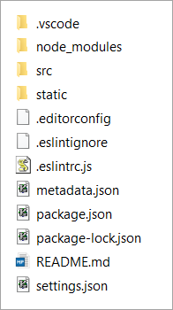

# Inspect the Folder Structure

After you have created a blueprint App, you should verify that the proper folder structure is created. Perform the following steps to do this:

1. Open the root folder of your project in an Explorer / Finder window.
2. Verify that the following folder structure exists:

(The presence of the `.eslint*` files depends on your choice to enable ESlint or not.)
3. Verify that the **src** folder contains the files `index.js` and `App.js`.

The (relevant) files and folders have the following meanings:

**Project root folder**

* `metadata.json`: App-related metadata
* `package.json`: project-related metadata
* `README.md`: instructions for configuration, installation, changelogs, et cetera
* `settings.json`: App-specific and platform-specific settings. (See [Stage Configuration](/lightning-core-reference/RuntimeConfig.md) settings for details.)

**Subfolder /src**

* `index.js`: launches your App
* `App.js`: the actual App
