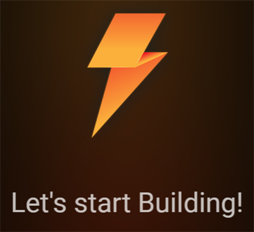
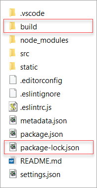

# Run Your App

After you created your blueprint App, you run it in your browser to verify that it works correctly.

> Perform the following instructions from the root folder of your App.

1. You can run your new Lightning App in either of the following two ways:
   * By running the following three *separate* commands consecutively:
      1. `lng build` to build a blueprint App
      2. `lng serve` to preview the blueprint App in your web browser
      3. `lng watch` to monitor any changes and – if that is the case – rebuild your App
   * By running the command `lng dev`, which builds and launches your App and keeps watching for changes to automatically rebuild. This command *combines* the commands `lng build`, `lng serve` and `lng watch`.
   
	Either case, a browser window opens in which the default text is displayed:
	
3. Verify that the following folder and file have been added to the structure:

	
   * **/build**: the necessary files and folders for running your App
   * **package-lock.json** describes the exact tree that was generated. It is automatically generated for any operations where `npm` modifies either the `node_modules` tree or `package.json`. (See info on [Package-lock.json](https://docs.npmjs.com/cli/v6/configuring-npm/package-lock-json) for details.)