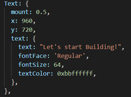

# Try Out Your App

After you created your new Lightning App, you can try it out to verify that it works. All you have to do is change the default text that is displayed.

Perform the following steps to try out your new Lightning App:

1. Type `lng dev` in the command prompt (in the root folder of your project). A browser window opens, displaying the default text (e.g., '*Let's start Building*'!).
2. Open the **App.js** file in the **/src** folder for editing.
3. Browse to the part that displays the text:

	
4. Replace the default text with anything you want, for example: '*Hello World!*'.
5. Save your changes.
6. Refresh your browser to see your changes.

	