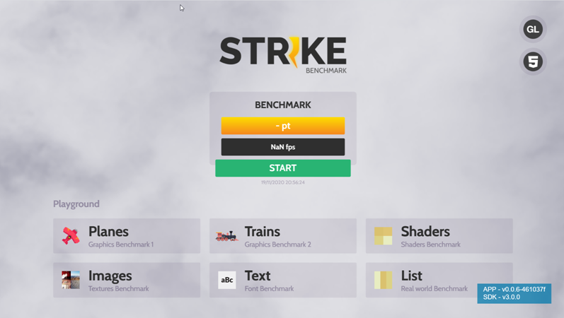
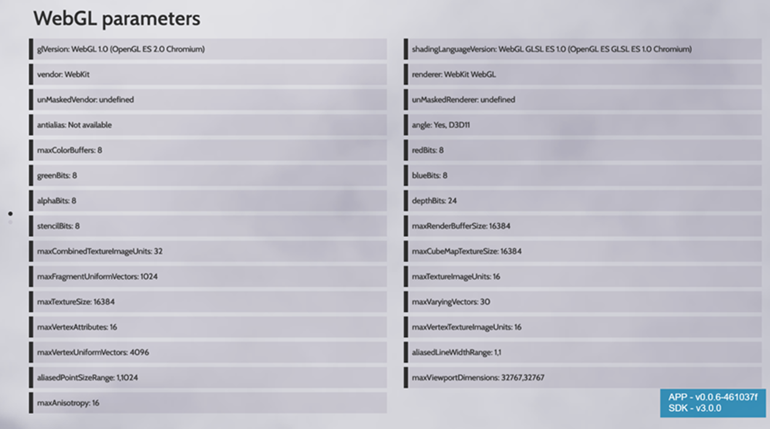
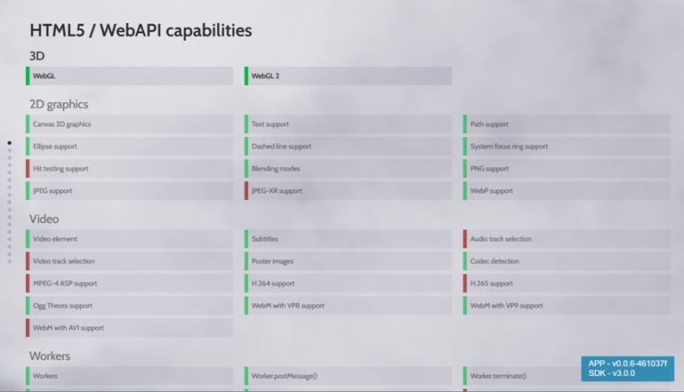
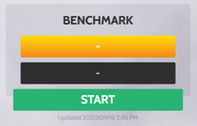
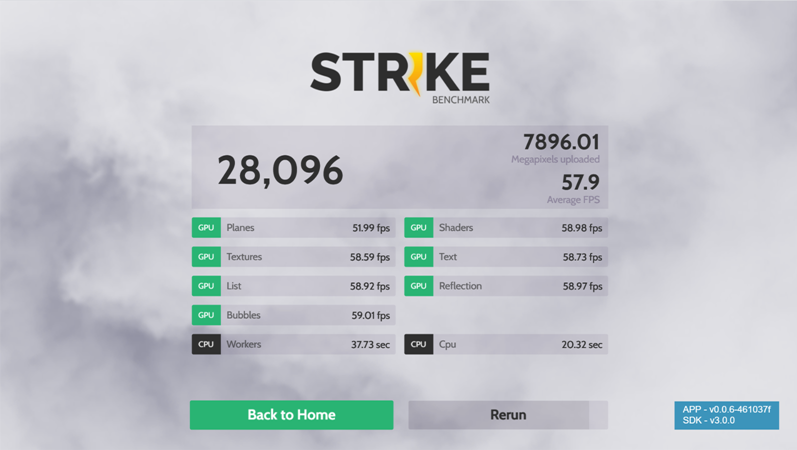
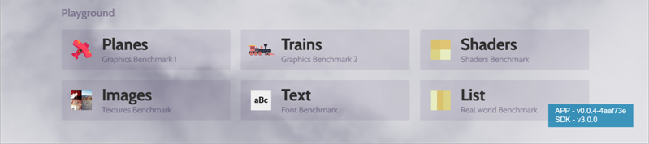
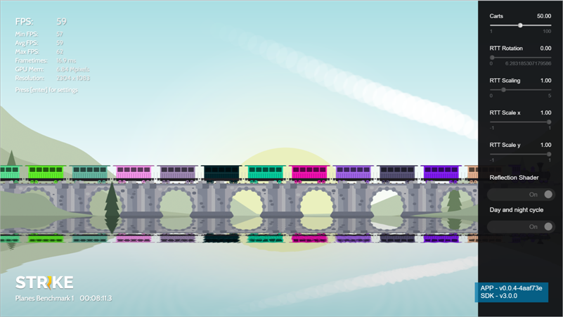

# Strike Benchmarking Tool

This topic contains describes what Strike is, how to use it and what to use it for. After reading this content, you should be able to launch Strike on a compatible device and understand the concept of the various tests and resulting score.

## Purpose of Strike

Strike is a benchmarking tool that runs on a web browser and performs the following tasks:

* Measure to what extent your software stack is compatible with running Lightning applications.
* Measure how well your software and hardware stack can perform Lightning applications.
* Test the graphical capabilities of your software and hardware configuration.
* Measure the capabilities of the web browser in which Strike is executed.
* Provide a total score to your software and hardware configuration.

> Strike is not intended to test the capabilities of audio / video play-out.

## Usage

### Prerequisites

To enable the use of Strike, you need a web browser that supports WebGL and JavaScript ES5 or higher. (This should be any browser from the year 2015 onwards.)

### How to launch

Launch Strike by pointing your browser to the [Strike App](http://strike.lightningjs.io).

> To prevent any problems with security and / or certificates, Strike is hosted on an http site. But you are free to use https instead.

### What you will see

After launching Strike, its Home page is displayed that looks like the following example:

> The Strike Home page might slightly differ from the image above. It merely serves as an example.

### Control and Navigation

Strike does *not* support the use of a mouse. You can control Strike with the **Up**, **Down**, **Left**, **Right**, **OK** and **Return** keys on your device.

If you run Strike from a web browser on your Mac or Windows PC, you can use the following keys on your keyboard:

* **Up**, **Down**, **Left** and **Right** keys
* **Backspace** (Windows PC) or **Delete** (Mac)
* **Enter**

You can exit a benchmark by pressing **Back** (or **Backspace** on your keyboard).

> Strike does not provide audio capabilities.

## Explanation of Features

The **WebGL compatibility test** checks if WebGL is supported, and verifies that it complies with the relevant Lightning specs.

Perform the following steps to launch the WebGL compatibility test:

1. Activate the **GL** icon.  The test is executed and the results are displayed.
2. From the results window, press **Back** (or **Backspace** on your keyboard) to return to the Home page.

The image below shows an example of the WebGL compatibility test results:

The **HTML5 compatibility test** checks if your browser supports HTML5, and verifies that it complies with the relevant Lightning specs.

Perform the following steps to launch the HTML5 compatibility test:

1. Activate the **HTML5** icon. The test is executed and the results are displayed.
2. From the results window, press **Back** (or **Backspace** on your keyboard) to return to the Home page.

The image below shows an example of the HTML5 compatibility test results:

### Benchmark

This pane comprises the *complete* Strike benchmark test, which is executed in a fully automated flow.

Perform the following steps to launch the Strike benchmark test:

1. Activate the **Start** icon. The Strike benchmark test performs a series of consecutive GPU and CPU benchmark tests (for example, Shaders and WebWorkers), each of which is displayed on the screen. These tests are executed automatically and cannot be paused nor stopped.
2. From the results window, select **Back to Home** to go back to the Strike Home page, or select **Rerun** to perform the complete Strike Benchmark test all over again.

> The complete Strike Benchmark test may last between 15 and 30 minutes. Please wait until it ends.

The example below shows an example of the Strike benchmark test results:

>  The results are displayed with the English units of measurement.

The calculation of the **score**(in points) is based on metrics that can be measured in the browser. For instance, the number of frames per second (fps) is an important indication for the graphical performance, and the time (in seconds) that it takes to do a number of predefined test calculations is relevant for the CPU performance.

In the example, you see a total score of 28,096 with 7896.01 uploaded megapixels and an average of 57.9 fps.

>  The resulting classification (Low / Medium / High) will be provided as soon as more result readouts are available.

### Playground

You can use the Playground pane to perform individual benchmarks, and to see the results based on your specific settings. Each benchmark has its own *default* settings, which you can adjust in the associated menu in a separate panel on the right.

The following figure shows an example of Playground benchmarks:

>  The Playground benchmarks displayed in the image above are the benchmarks that were available at the time this documentation was written. Please keep in mind that they serve as an example, and that they may change over time.

Perform the following steps to launch a Playground benchmark:

1. Start the desired benchmark using the **Up** / **Down** / **Left** / **Right** keys.
2. Press  **Enter** to enter the benchmark.

Invoke the corresponding menu with settings as follows:

1. Press the **Enter** key to display the settings menu in the right pane.
2. Navigate through this menu using the **Up** / **Down** / **Left** / **Right** keys.
3. Click **Back** if you want to exit the menu.

### Example: Trains

The **Trains** benchmark serves as a representative example of how you can use the Playground benchmarks, and how you can adjust the settings to see the corresponding changes in the result.

After launching the Trains benchmark test, press **Enter** to invoke the settings menu on the right:

Use the **Up** and **Down** keys to go to a specific setting. Each setting has its own default value, range and increments.

Change the value of a setting with the **Left** and **Right** keys. Your change is immediately reflected in the resulting values in the top left corner as well as in the image.

The settings for the Trains benchmark are:

* Carts: the number of carts to be displayed.
* RTT (Round-Trip Time) Rotation: the rotation degree of the image.
* RTT Scaling (general RTT scaling): sets *both* the x scaling and the y scaling simultaneously. This setting *overrules* any specific x and / or y scale setting (see below).
* RTT Scale x / RTT Scale y: specific x and / or y scale setting. This setting *overrules* the general scale setting (see above).
* Reflection Shader: indicates whether the reflection shader is On or Off (use the **Enter** key to toggle).
* Day and night cycle: indicates whether the day and night cycles are On or Off  (use the **Enter** key to toggle). If set to Off, you’ll see the trains running with a light background and the sun shining. If set to On, you’ll see the trains running in daylight AND, after one full run (depending on the number or carts), the sun will set, stars will rise and the trains will run through the night.

## Troubleshooting

###  I’m unable to navigate in Strike.

Assure that you’re sending the correct keys to the web browser.

Strike is implemented to listen / react to the equivalent of the following key mapping:

* UP
* DOWN
* LEFT
* RIGHT
* BACK
* OK

>  You can use a 3rd party website to check which key code mapping applies to your browser.

### My mouse is not working.

Strike is not intended to be controlled by mouse. Strike is intended to measure graphical capabilities and performance.

### My browser crashes.

You might have a browser compatibility problem. Use the appropriate tools to verify the source of the problem.

### I see black artifacts on my screen or my screen turns completely black.

You have probably run out of GPU memory. Use the appropriate tools to check the available memory during the test.

### It seems that the benchmark hangs during execution

Wait about 30 minutes. If there is still no progress, restart your device or browser.
